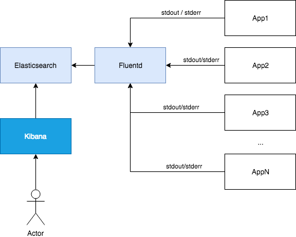
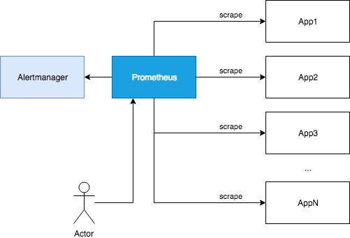
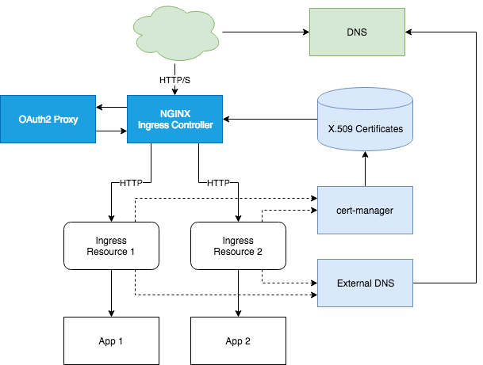

# Bitnami Kubernetes Production Runtime

## Description

The Bitnami Kubernetes Production Runtime (BKPR) is a collection of services that makes it easy to run production workloads in Kubernetes.

Think of Bitnami Kubernetes Production Runtime as a curated collection of the services you would need to deploy on top of your Kubernetes cluster to enable logging, monitoring, certificate management, automatic discovery of Kubernetes resources via public DNS servers and other common infrastructure needs.

BKPR is available for [Google Kubernetes Engine (GKE)](https://cloud.google.com/kubernetes-engine) and [Azure Kubernetes Service (AKS)](https://azure.microsoft.com/en-in/services/kubernetes-service/) clusters.

## License

BKPR is licensed under the [Apache License Version 2.0](LICENSE).

## Requirements

BKPR has been tested to work on a bare-minimum Kubernetes cluster with three kubelet nodes with 2 CPUs and 8GiB of RAM each.

## Kubernetes version support matrix

The following matrix shows which Kubernetes versions and platforms are supported:

| BKPR release | Kubernetes versions | AKS | GKE |
|:------------:|:-------------------:|:---:|:---:|
|     `0.3`    |   `1.8`-`1.9`       | Yes | No  |
|     `1.0`    |   `1.9`-`1.10`      | Yes | Yes |
|     `1.1`    |   `1.10`-`1.11`     | Yes | Yes |

## Quickstart

Please use the [installation guide](docs/install.md) to install the `kubeprod` binary before installing BKPR to your cluster.

* [AKS Quickstart](docs/quickstart-aks.md)
* [GKE Quickstart](docs/quickstart-gke.md)

## Frequently Asked Questions (FAQ)

Please read the [FAQ](docs/FAQ.md).

## Versioning

The versioning used in BKPR is described [here](docs/versioning.md).

## Components

BKPR leverages the following components to achieve its mission. For more in-depth documentation about them please read the [components](docs/components.md) documentation.

### Logging stack

* [Elasticsearch](docs/components.md#elasticsearch): A distributed, RESTful search and analytics engine
* [Fluentd](docs/components.mdfluentd): A data collector for unified logging layer
* [Kibana](docs/components.md#kibana): A visualization tool for Elasticsearch data

### Monitoring stack

* [Prometheus](docs/components.md#prometheus): A monitoring system and time series database
* [Alertmanager](docs/components.md#alertmanager): An alert manager and router

### Ingress stack

* [NGINX Ingress Controller](docs/components.md#nginx-ingress-controller): A Controller to satisfy requests for Ingress objects
* [cert-manager](docs/components.md#cert-manager): A Kubernetes add-on to automate the management and issuance of TLS certificates from various sources
* [OAuth2 Proxy](docs/components.md#oauth2-proxy): A reverse proxy and static file server that provides authentication using Providers (Google, GitHub, and others) to validate accounts by email, domain or group
* [ExternalDNS](docs/components.md#externaldns): A component to synchronize exposed Kubernetes Services and Ingresses with DNS providers

## Release compatibility

### Components version support

The following matrix shows which versions of each component are used and supported in the most recent releases of BKPR:

|   Component   |          BKPR 1.0  |          BKPR 1.1  |
|:-------------:|-------------------:|-------------------:|
|   Prometheus  |            `2.3.2` |            `2.6.0` |
|     Kibana    |           `5.6.12` |           `5.6.14` |
| Elasticsearch |           `5.6.12` |           `5.6.14` |
|  cert-manager |            `0.5.2` |            `0.5.2` |
|  Alertmanager |           `0.15.2` |           `0.15.3` |
|  ExternalDNS  |            `0.5.4` |            `0.5.9` |
| nginx-ingress |           `0.19.0` |           `0.21.0` |
|  oauth2_proxy | `0.20180625.74543` | `0.20180625.74543` |
|    Heapster   |            `1.5.2` |              `N/A` |
|    Fluentd    |            `1.2.2` |            `1.3.2` |

## Contribute code

If you would like to become an active contributor to this project please follow the instructions provided in [contribution guidelines](CONTRIBUTING.md).
