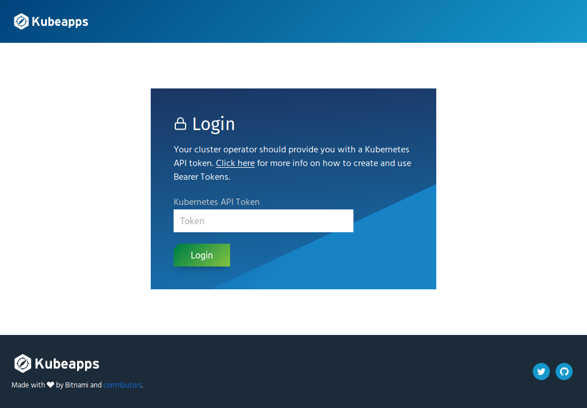

# Installing Kubeapps on BKPR

This guide documents the installation of [Kubeapps](https://kubeapps.com/) to your Kubernetes Production Runtime (BKPR) cluster. You will first install the [Helm](https://www.helm.sh/) package manager to the cluster, followed by the installation of Kubeapps using the [Kubeapps Helm chart](https://hub.kubeapps.com/charts/bitnami/kubeapps).


The guide assumes you have a Kubernetes cluster with BKPR already installed. The [BKPR installation guide](install.md) documents the process of installing the BKPR client, followed by installing the BKPR server side components to the cluster.

## Step 1: Install the Helm client

Follow the instructions in [Helm installation guide](https://docs.helm.sh/using_helm/#installing-the-helm-client) to install the latest release of the Helm binary to your machine.

## Step 2: Install the Tiller server

Tiller is the server-side component of Helm that runs inside your Kubernetes cluster. To install the Tiller server to the cluster you should use the `helm` client installed by the previous step. However, before we do so, for RBAC enabled clusters we need to create a service account for the Tiller server.

For the purposes of this guide we'll create a Kubernetes service account with super-user cluster access (`cluster-admin`). Check out the guide on [Tiller and Role-Based Access Control](https://github.com/helm/helm/blob/master/docs/rbac.md) to learn about restricting the scope of Tiller in the cluster.

Begin by creating a file named `rbac-tiller.yaml` with the following content:

```yaml
apiVersion: v1
kind: ServiceAccount
metadata:
  name: tiller
  namespace: kube-system
---
apiVersion: rbac.authorization.k8s.io/v1
kind: ClusterRoleBinding
metadata:
  name: tiller
roleRef:
  apiGroup: rbac.authorization.k8s.io
  kind: ClusterRole
  name: cluster-admin
subjects:
  - kind: ServiceAccount
    name: tiller
    namespace: kube-system
```

Create the service account using the `kubectl` command tool:

```bash
kubectl create -f rbac-tiller.yaml
```

Next, we use the `helm` client to install the Tiller server to the cluster:

```bash
helm init --service-account tiller
```

Voila, you have installed Helm to your cluster.

## Step 3: Install Kubeapps

Kubeapps is a open-source web-based UI for deploying and managing applications in Kubernetes clusters. It provides you a dashboard to:

    - Browse Helm charts from public or your own private chart repositories and deploy them to your cluster
    - Upgrade, manage and delete the applications that are deployed in your cluster
    - Browse and provision external services from the Service Catalog

Kubeapps can be installed using the [Kubeapps Helm chart](https://hub.kubeapps.com/charts/bitnami/kubeapps) from the official [Bitnami charts repository](https://github.com/bitnami/charts).

Begin by configuring the Helm client to use the Bitnami charts repository.

```bash
helm repo add bitnami https://charts.bitnami.com/bitnami
```

Now you can easily install Kubeapps to your Kubernetes cluster with the following command:

```bash
helm install --name kubeapps --namespace kubeapps bitnami/kubeapps \
    --set mongodb.metrics.enabled=true \
    --set ingress.enabled=true \
    --set ingress.hosts[0].name=kubeapps.[YOUR-BKPR-ZONE] \
    --set ingress.hosts[0].tls=true \
    --set ingress.hosts[0].tlsSecret=kubeapps-tls \
    --set ingress.hosts[0].certManager=true
```

The command line flags provided in the above command enable the Ingress resource in the Kubeapps chart and also enable TLS support. Once installed, you will be able to access the Kubeapps dashboard securely (HTTPS) over the internet at `https://kubeapps.[YOUR-BKPR-ZONE]`.

_Please replace the placeholder string `[YOUR-BKPR-ZONE]` in the above command with the DNS zone configured while setting up BKPR in you Kubernetes cluster._

Kubeapps requires users to login before making requests.  However, if you would not like the dashboard to be accessible externally over the Internet, please disable the Ingress support while installing the chart.  If Ingress is disabled, you need to follow the Kubeapps post-install instructions to access the dashboard using a proxy connection to the cluster.

The chart parameter `mongodb.metrics.enabled=true` in the above command, enables the Prometheus exporter for MongoDB in the Kubeapps chart.

> **Tip**:
>
> When installing applications to your cluster, remember to enable Prometheus exporters in applications that support them. The exported instrumentation data will be automatically scrapped by the Prometheus server installed in the cluster by BKPR and will provide useful insights into the clusters performance.

## Step 4: Generate a access token

The Kubeapps dashboard will prompt you to provide a access token before allowing you to make any changes to the Kubernetes cluster. For the purpose of this guide we will generate a super-user access token using the commands listed below. Check out the [Access Control in Kubeapps](https://github.com/kubeapps/kubeapps/blob/master/docs/user/access-control.md) document to learn about specifying access privileges for users of the dashboard.



```bash
kubectl create serviceaccount kubeapps-operator
kubectl create clusterrolebinding kubeapps-operator \
  --clusterrole=cluster-admin \
  --serviceaccount=default:kubeapps-operator
```

Get the value of the generated access token with:

```bash
kubectl get secret -o jsonpath='{.data.token}' \
    $(kubectl get serviceaccount kubeapps-operator -o jsonpath=' {.secrets[].name}') \
    | base64 --decode
```

You should now be able to login to the Kubeapps dashboard using the displayed access token and install applications to the cluster using the available Helm charts or by adding your own private Helm chart repositories. Check out the [Kubeapps User Documentation](https://github.com/kubeapps/kubeapps/tree/master/docs/user) to learn more about Kubeapps and its offerings.

## Further Reading

- [Application Developer's Reference Guide](application-developers-reference-guide.md)
- [BKPR FAQ](FAQ.md)
